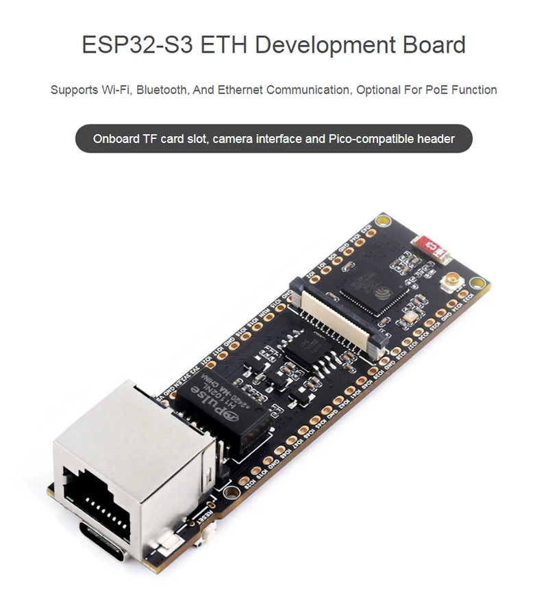
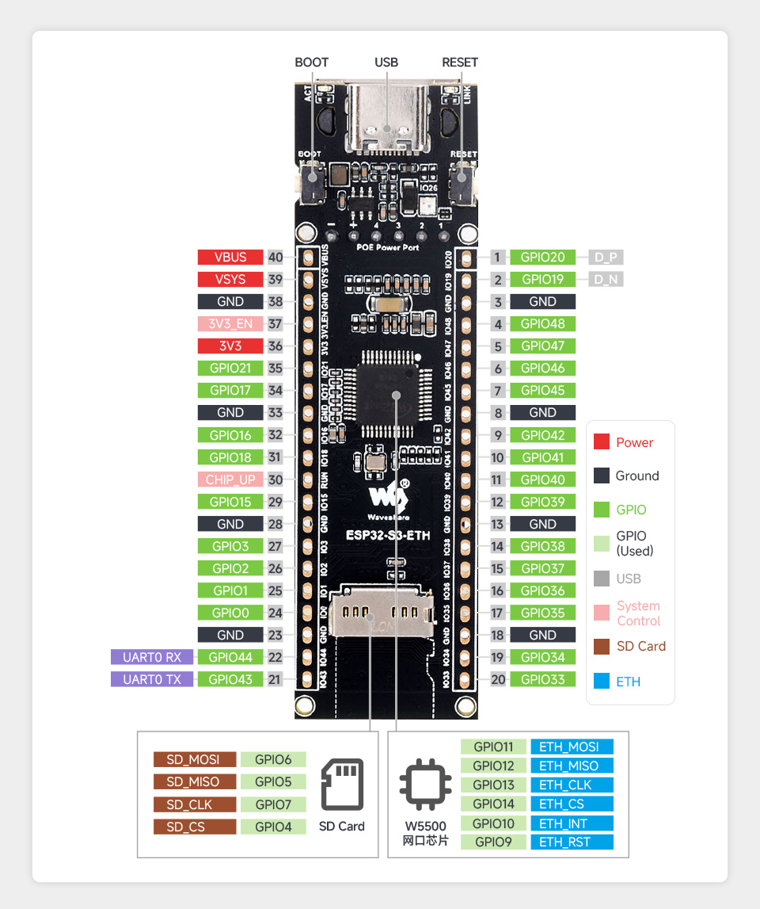

# ESP32-S3R8 ETH W5500 (SPI)

The ESP32-S3R8 is a dual-core ESP32-S3 board with Ethernet connectivity via W5500 SPI interface.

<center></center>

## Specifications

- **Microcontroller**: ESP32-S3R8 (dual-core Xtensa LX7, 240MHz)
- **Ethernet**: W5500 SPI
- **Flash**: 8MB
- **PSRAM**: 8MB
- **GPIO**: 45 usable pins
- **USB**: USB-C with JTAG support
- **ADC**: 20 ADC channels (ADC1 + ADC2)

## ESPHome Configuration

```yaml
esp32:
  board: esp32-s3-devkitc-1
  framework:
    type: esp-idf

ethernet:
  type: W5500
  clk_pin: GPIO13
  mosi_pin: GPIO11
  miso_pin: GPIO12
  cs_pin: GPIO14
  interrupt_pin: GPIO10
  reset_pin: GPIO9
```

## Programming

Connect board through USB-C to your PC. If programming fails, try these steps to enter programming mode:

1. Long press BOOT button
2. Press and release RESET while holding BOOT
3. Release BOOT button
4. Module enters download mode

## Pinout




## Pin Restrictions

- **Strapping pins**: GPIO0, GPIO3, GPIO45, GPIO46
- **USB pins**: GPIO19, GPIO20 (can be reconfigured as GPIO)
- **JTAG pins**: GPIO39, GPIO40, GPIO41, GPIO42
- **ADC2 conflict**: Cannot use ADC2 with WiFi simultaneously

## Resources

- [Waveshare ESP32-S3-ETH Wiki](https://www.waveshare.com/wiki/ESP32-S3-ETH)
- [ESP32-S3 Datasheet](https://www.espressif.com/sites/default/files/documentation/esp32-s3_datasheet_en.pdf)
- [W5500 Datasheet](https://www.wiznet.io/product-item/w5500/)