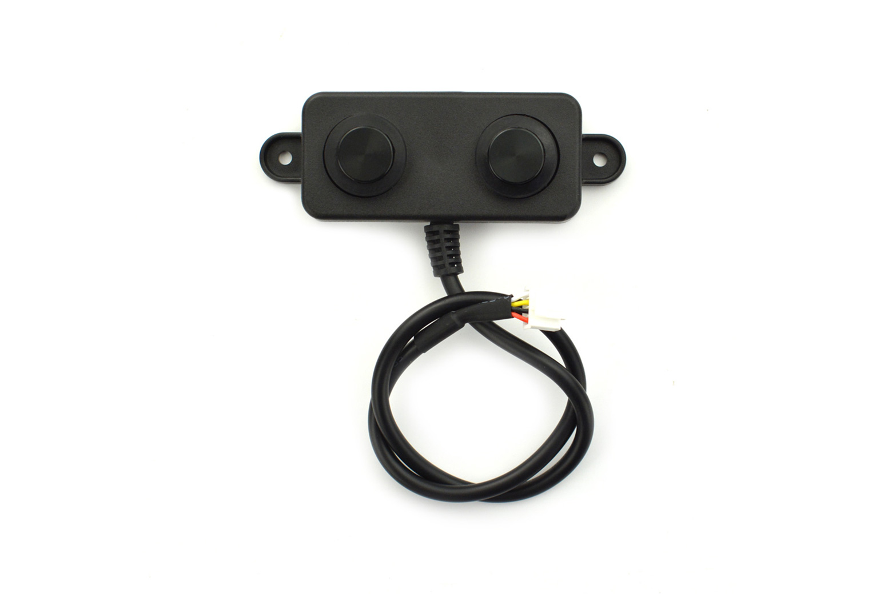

# A02 Ultrasonic Sensor - UART



The A02 sensor can be operated with 3.3-5V input and is supported by ESPHome as [a02yyuw](https://esphome.io/components/sensor/a02yyuw/) and has a measurement range from 3 to 450cm.

There are several A02 Models available, only the ones with UART are compatible with ESPHome with available sensor components. There is a UART Auto and UART Controlled version according to the dataset - the Auto sends new values whenever the measurement changes, the Controlled must be queried by a falling edge on the RX input. Some posts make it seem that they are two different hardware models, but the [A022IAU](https://de.aliexpress.com/item/1005006749965386.html) I have can be used with the built in [a02yyuw](https://esphome.io/components/sensor/a02yyuw/) sensor, or alternative with manual query with [a0021AT](https://github.com/flamedodger/a0221at) as external component.

[Datasheet](a02-datasheet.pdf)

[Output Interfaces](a02-output-interfaces.pdf)

## Pinout

1. (red): VCC
2. (black): GND
3. (yellow): RX - connect to tx_pin on esp32
4. (white): TX - connect to rx_pin on esp32

## Example Code

```yaml
uart:
  tx_pin: GPIO13
  rx_pin: GPIO12
  baud_rate: 9600
  id: uart_1 # optional

sensor:
  - platform: "a02yyuw"
    name: "Fill Level"
    id: tank_level_mm
    uart_id: uart_1 # optional
    filters:
      - or:
        - delta: 4.5
        - heartbeat: 60s
    on_value:
      then:
        - lambda: |
            float depth = 500.0;
            float mm = x;
            if (isnan(mm)) mm = 0;
            if (mm > depth) mm = depth;
            if (mm < 0) mm = 0;
            id(tank_level_percentage).publish_state((mm / depth) * 100.0);
  - platform: template
    name: "Fill Level %"
    unit_of_measurement: "%"
    id: tank_level_percentage
    accuracy_decimals: 1
```
